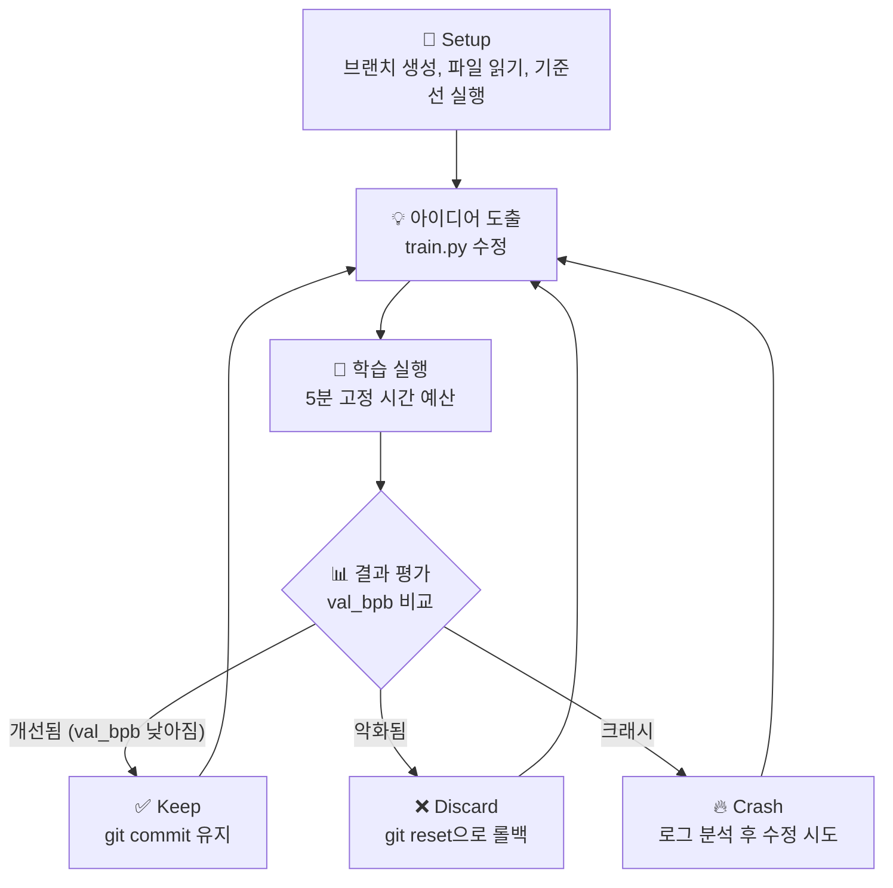

# Autoresearch 깊이 분석 & AI 모델 학습에의 활용

## 1. Autoresearch란 무엇인가?

### 한 줄 요약
> **AI 에이전트가 사람 대신 밤새 실험을 돌리고, 좋은 결과만 남기는 "자동 연구원" 시스템**

[karpathy/autoresearch](https://github.com/karpathy/autoresearch)는 Andrej Karpathy(전 Tesla AI 총괄, OpenAI 공동창업멤버)가 2026년 3월에 공개한 프로젝트로, **AI 에이전트(Claude, Codex 등)에게 실제 LLM 학습 코드를 주고 자율적으로 실험하게 하는 시스템**입니다.

### 핵심 철학

```
사람이 코드를 직접 수정하는 것이 아니라,
AI 에이전트에게 "어떻게 연구하라"는 지시서(program.md)를 작성하면
에이전트가 스스로 코드를 고치고 → 학습하고 → 평가하고 → 반복합니다.
```

Karpathy의 말을 빌리면:

> *"You're not touching any of the Python files like you normally would as a researcher. Instead, you are programming the program.md Markdown files that provide context to the AI agents and set up your autonomous research org."*
>
> (연구자로서 평소처럼 Python 파일을 직접 건드리는 게 아닙니다. 대신, AI 에이전트에게 맥락을 제공하고 자율 연구 조직을 구성하는 program.md 마크다운 파일을 프로그래밍하는 것입니다.)

---

## 2. 어떻게 동작하는가? (구조 상세 해설)

### 2.1 프로젝트 구성 — 단 3개의 핵심 파일

| 파일 | 역할 | 수정 주체 |
|------|------|-----------|
| `prepare.py` | 데이터 다운로드, 토크나이저 학습, 데이터로더, 평가 함수 (고정) | ❌ 수정 불가 |
| `train.py` | GPT 모델 구조, 옵티마이저(Muon + AdamW), 학습 루프 — **모든 것이 변경 가능** | 🤖 AI 에이전트 |
| `program.md` | AI 에이전트에게 주는 지시서 — 연구 방법론, 규칙, 루프 정의 | 👤 사람 |

### 2.2 실험 루프 — AI가 밤새 반복하는 과정



**구체적으로 매 실험마다 일어나는 일:**

1. **아이디어 생성**: AI가 코드를 읽고 개선 아이디어를 생각함 
2. **코드 수정**: `train.py`를 직접 편집 (아키텍처, 하이퍼파라미터, 옵티마이저 등)
3. **Git 커밋**: 변경사항 저장
4. **학습 실행**: `uv run train.py > run.log 2>&1` (정확히 5분)
5. **결과 확인**: `val_bpb` (validation bits per byte) 확인
6. **판단**: 개선되면 유지(keep), 동일/악화면 폐기(discard), 크래시면 디버깅
7. **기록**: `results.tsv`에 모든 결과 로깅
8. **반복**: **사람이 멈출 때까지 무한 반복**

### 2.3 핵심 설계 원칙

| 원칙 | 설명 |
|------|------|
| **단일 파일 수정** | AI는 `train.py` 하나만 수정 → 변경사항 추적이 쉬움 |
| **고정 시간 예산 (5분)** | 어떤 실험이든 동일 시간 → 공정한 비교 가능 |
| **단일 GPU** | 복잡한 분산 학습 없이 GPU 1개로 완결 |
| **단일 메트릭 (val_bpb)** | 평가 기준이 하나 → 명확한 개선/악화 판단 |
| **절대 멈추지 않음** | 사람이 잠든 동안에도 지속적으로 실험 (~12실험/시간, ~100실험/하룻밤) |

### 2.4 실험 결과 예시

```tsv
commit	val_bpb	memory_gb	status	description
a1b2c3d	0.997900	44.0	keep	baseline
b2c3d4e	0.993200	44.2	keep	increase LR to 0.04
c3d4e5f	1.005000	44.0	discard	switch to GeLU activation
d4e5f6g	0.000000	0.0	crash	double model width (OOM)
```

AI가 Learning Rate를 올려서 0.004 정도 개선을 얻었고, GeLU로 바꾸는 건 실패했으며, 모델 너비를 두 배로 하면 메모리 부족(OOM)으로 크래시했습니다.

---

## 3. AI 모델 학습에 어떤 도움을 받을 수 있는가?

Autoresearch의 방법론은 LLM 학습뿐 아니라 **거의 모든 딥러닝 학습 시나리오**에 적용할 수 있습니다.

### 3.1 직접적으로 도움받는 영역

#### ① 하이퍼파라미터 자동 탐색
```
기존 방식: 사람이 learning rate, batch size 등을 수동으로 하나씩 바꿔 실험
Autoresearch: AI가 자동으로 조합을 시도하고 최적값을 찾아감
```
- Learning Rate, Weight Decay, Warmup/Warmdown 비율
- Batch Size, Sequence Length
- 옵티마이저 선택 (AdamW vs Muon vs SGD 등)

#### ② 모델 아키텍처 탐색 (NAS의 간이 버전)
```
기존 방식: 논문을 읽고 사람이 아키텍처를 설계
Autoresearch: AI가 Layer 수, Attention 패턴, Hidden Dimension 등을 자동으로 실험
```
- Transformer의 Depth(깊이), Width(넓이) 조정
- Attention 윈도우 패턴 변경 (Full attention vs Sliding window)
- Activation 함수 변경 (ReLU, GeLU, SiLU 등)

#### ③ 학습 스케줄 최적화
- Learning Rate 스케줄 (cosine, linear, step decay 등)
- Warmup/Warmdown 비율
- Gradient accumulation 전략

#### ④ 코드 수준의 최적화
- 메모리 효율적인 구현 탐색
- 연산 순서 최적화
- 불필요한 연산 제거 (단순화)

### 3.2 Autoresearch 방식이 특별한 이유

| 기존 자동화 도구 | Autoresearch |
|-----------------|-------------|
| Optuna, Ray Tune: 정해진 하이퍼파라미터 공간만 탐색 | **코드 자체를 수정** — 아키텍처, 알고리즘, 최적화 기법 모두 변경 가능 |
| NAS: 미리 정의된 탐색 공간 필요 | **제한 없는 탐색 공간** — 코드가 할 수 있는 모든 것이 가능 |
| AutoML: 특정 프레임워크에 종속 | **프레임워크 무관** — Python 코드만 있으면 됨 |
| Grid/Random Search: "설정값"만 변경 | **아이디어 레벨의 변경** — 새로운 기법 도입 가능 |

---

## 4. 예시: Dual Distillation (LPCVC 대회 출전)에 적용

> [!NOTE]
> `lpcvc-2026-CNU/dual-distillation_ver2` GitHub 레포는 현재 접근이 불가능합니다(404). 이하 분석은 LPCVC 대회와 Dual Distillation 기법의 일반적인 특성을 기반으로 작성합니다.

### 4.1 배경 설명

#### LPCVC (Low Power Computer Vision Challenge)란?
- Qualcomm이 후원하는 **저전력 컴퓨터 비전 대회**
- 2026년 트랙: Image-to-Text Retrieval, Action Recognition, AI-generated Image Detection
- **핵심 제약**: 모바일/엣지 디바이스에서 실행 → 모델이 작고 빨라야 함
- 평가 기준: **실행 시간 + 정확도** 두 축으로 순위 결정

#### Knowledge Distillation (지식 증류)란?

입문자를 위한 비유:

```
🎓 Teacher (큰 모델) = 대학교수님
  ↓ 지식 전달
🎒 Student (작은 모델) = 학생

교수님이 아는 것을 학생에게 가르쳐서,
학생이 교수님만큼은 아니어도 꽤 잘하게 만드는 것
```

**기술적으로:**
- Teacher 모델: 크고 정확하지만 느림 (예: ViT-Large, ResNet-152)
- Student 모델: 작고 빠르지만 덜 정확함 (예: MobileNet, EfficientNet-B0)
- Distillation: Teacher의 출력(soft label)을 Student가 학습 → Student 성능 향상

#### Dual Distillation (이중 증류)란?

```
📚 Teacher A (예: 이미지 전문)  ──┐
                                  ├──→ 🎒 Student (작은 모델)
📚 Teacher B (예: 텍스트 전문)  ──┘

두 명의 교수님이 함께 가르치면
학생은 더 다양한 관점을 배울 수 있음
```

주요 변형들:
- **Dual-Teacher**: 서로 다른 두 Teacher에서 동시에 배움
- **Dual-Level**: 개별 샘플 지식 + 샘플 간 관계 지식을 함께 학습
- **Dual-Space**: Teacher와 Student의 출력 공간을 통일하여 더 효과적으로 전달

### 4.2 Autoresearch 방법론을 Dual Distillation에 적용하는 방법

아래 4단계로 autoresearch의 자동 실험 방식을 Dual Distillation 프로젝트에 적용할 수 있습니다.

---

#### **Step 1: 프로젝트 구조를 Autoresearch 패턴으로 재구성**

```
dual-distillation/
├── prepare.py        # 🔒 고정: 데이터 로딩, 평가 함수, 상수
├── train.py          # 🤖 AI가 수정: 모델, 증류 로직, 학습 루프
├── program.md        # 👤 사람이 작성: AI에게 줄 연구 지시서
├── results.tsv       # 자동 생성: 실험 결과 로그
└── pyproject.toml    # 의존성
```

**핵심 원칙:**
- `prepare.py`에 **평가 함수**와 **데이터 로딩**을 고정
- `train.py`에 **Teacher 로딩, Student 정의, Distillation Loss, 학습 루프**를 넣음
- AI는 `train.py`의 **모든 것**을 자유롭게 수정할 수 있음

---

#### **Step 2: program.md 작성 — AI에게 줄 연구 지시서**

아래는 Dual Distillation용 `program.md` 예시입니다:

```markdown
# Dual Distillation Autoresearch

## 목표
LPCVC 평가 기준에 맞춰 Student 모델의 **정확도/성능(accuracy)**을
최대화하되, **모델 크기와 추론 속도**를 제약 조건으로 유지한다.

## Setup
1. 브랜치 생성: autoresearch/<tag>
2. 파일 읽기: prepare.py(고정), train.py(수정 대상)
3. 데이터 확인: 학습/검증 데이터가 올바르게 로딩되는지 확인
4. 기준선 측정: 현재 코드로 한 번 학습 실행

## 실험 규칙
- **수정 가능**: train.py의 모든 것
  - Student 아키텍처 변경
  - Distillation loss 함수 변경 (KL-div, MSE, CRD 등)
  - Teacher-Student 간 feature matching 레이어
  - Temperature, alpha(soft/hard loss 비율)
  - Learning rate, optimizer, scheduler
  - Data augmentation 전략
- **수정 불가**: prepare.py, 평가 함수, 데이터셋

## 평가 메트릭
- 주 메트릭: val_accuracy (높을수록 좋음)
- 부 제약: model_params < 5M, inference_time < 30ms
- 제약 위반 시 자동 discard

## 실험 루프
1. 아이디어 생성 → train.py 수정 → git commit
2. 학습 실행 (5분 제한)
3. 결과 평가 → keep/discard/crash
4. results.tsv에 기록
5. 무한 반복
```

---

#### **Step 3: AI가 탐색할 수 있는 실험 영역**

AI 에이전트가 Dual Distillation에서 시도할 수 있는 실험들:

| 카테고리                     | 구체적 실험 내용                                        |
| ------------------------ | ------------------------------------------------ |
| **Distillation 방식**      | KL-Divergence → MSE Loss → CRD(Contrastive) 전환   |
| **Temperature 조정**       | T=1 → T=4 → T=10 → 최적 온도 탐색                      |
| **Loss 가중치**             | α(soft loss)=0.7, β(hard loss)=0.3 → 비율 최적화      |
| **Feature 매칭**           | 중간 레이어 feature를 추가로 증류 (hint learning)           |
| **Student 구조**           | MobileNetV2 → EfficientNet-B0 → ShuffleNet 전환    |
| **Teacher 조합**           | Single teacher → Dual teacher → Ensemble teacher |
| **Attention Transfer**   | Self-attention map을 Teacher→Student로 전달          |
| **Data Augmentation**    | CutMix, MixUp, RandAugment 등 자동 실험               |
| **학습 스케줄**               | Cosine → StepLR → OneCycleLR 전환                  |
| **Progressive Learning** | 쉬운 샘플부터 학습 → Curriculum learning 도입              |

---

#### **Step 4: 실제 실행 시나리오**

```
🌙 밤 10시: 사람이 program.md 작성 → AI 에이전트 시작

[실험 1]  기준선 측정            val_acc: 72.3%  ✅ keep
[실험 2]  Temperature 4→8       val_acc: 73.1%  ✅ keep  (+0.8%)
[실험 3]  Feature matching 추가  val_acc: 72.8%  ❌ discard
[실험 4]  CRD loss 도입          val_acc: 73.5%  ✅ keep  (+0.4%)
[실험 5]  Student→EfficientNet   val_acc: 74.2%  ✅ keep  (+0.7%)
[실험 6]  모델 너비 2배            --crash--     🔥 OOM
[실험 7]  Attention transfer     val_acc: 74.8%  ✅ keep  (+0.6%)
...
[실험 ~100]

☀️ 아침 8시: 사람이 확인
→ results.tsv에 ~100개 실험 결과
→ val_acc: 72.3% → 77.1% (4.8%p 개선!!)
→ 어떤 기법이 효과적이었는지 한눈에 파악
```

---

## 5. 실전에서 Autoresearch 방식 적용하기 (입문자 가이드)

### 5.1 전제 조건
- **GPU가 있는 컴퓨터** (NVIDIA 권장, 최소 8GB VRAM)
- **AI 코딩 에이전트** (Claude Code, GitHub Copilot, Cursor 등)
- **기본적인 학습 코드** (기준선으로 동작하는 train.py)

### 5.2 단계별 적용 방법

```
Step 1: 학습 코드를 "단일 파일"로 정리
  └─ 모든 핵심 로직을 train.py 하나에 모으기

Step 2: 평가 함수를 "분리"하여 고정
  └─ prepare.py에 evaluate() 함수를 넣고 절대 수정 불가로 설정

Step 3: 시간 예산 설정
  └─ GPU에 따라 3분~10분 사이로 고정 학습 시간 설정

Step 4: 단일 메트릭 정의
  └─ 한 가지 숫자로 "좋다/나쁘다"를 판단할 수 있게
  └─ 예: val_accuracy, val_bpb, val_loss 등

Step 5: program.md 작성
  └─ AI에게 무엇을 바꿀 수 있고, 무엇을 바꾸면 안 되는지 명확히

Step 6: AI 에이전트 실행 → 자기 전에 시작해서 아침에 확인!
```

### 5.3 주의사항

> [!WARNING]
> - **평가 함수를 AI가 수정하면 안 됩니다** — metric을 조작해서 "개선된 것처럼" 만들 수 있음
> - **시간 예산을 고정해야 합니다** — 그래야 실험 간 공정한 비교가 가능
> - **git으로 반드시 관리** — 모든 실험을 추적하고, 실패 시 롤백 가능해야 함
> - **큰 모델은 작은 데이터셋으로 먼저** — OOM 걱정 없이 로직 검증 가능

> [!TIP]
> - `results.tsv`를 엑셀이나 Jupyter Notebook에서 시각화하면 트렌드를 쉽게 파악
> - 처음에는 간단한 하이퍼파라미터(LR, batch size)부터 탐색하게 하고, 점차 아키텍처 변경으로 확대
> - 여러 개의 `program.md`를 만들어 서로 다른 "연구 방향"을 병렬 탐색 가능

---

## 6. 정리: 왜 이것이 중요한가?

```
전통적 연구 방식:
  사람이 논문 읽기 → 아이디어 → 코드 수정 → 실험 → 기다림 → 분석 → 반복
  (하루에 3~5개 실험, 실험 중 사람은 놀고 있음)

Autoresearch 방식:
  사람이 program.md 작성 → AI가 자동으로 전부 수행
  (하루에 100개 이상 실험 가능, 사람은 아이디어와 방향 설정에만 집중)
```

**LPCVC 같은 경쟁 대회에서는 이 차이가 결정적입니다:**
- 제출 마감까지 더 많은 실험 = 더 최적화된 모델
- Knowledge Distillation의 수많은 하이퍼파라미터를 체계적으로 탐색
- 사람이 미처 생각못한 조합을 AI가 발견할 가능성

> [!IMPORTANT]
> Autoresearch의 핵심 인사이트는 "코드를 짜는 것"이 아니라 **"코드를 짜는 지시서(program.md)를 잘 짜는 것"**이 새로운 연구 역량이 된다는 점입니다. 이것을 Karpathy는 *"Programming the program"*이라 부릅니다.
